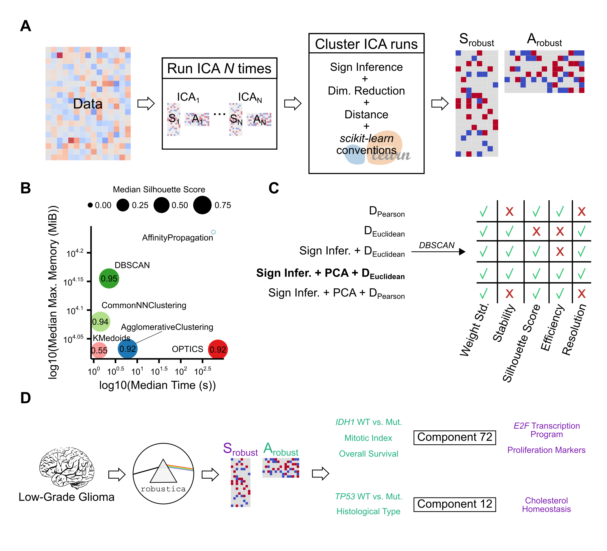

# `robustica`: customizable robust independent component analysis

This is the repository to reproduce the analysis carried out in our manuscript, from the data download to the figures. 
The article describes how we developed [`robustica`](https://github.com/CRG-CNAG/robustica), a Python package to carry out robust independent component analysis.

## Overview
<p align="center">
  
</p>

**Development and implementation of `robustica` to carry out robust Independent Component Analysis (ICA).** 
(**A**)`robustica` enables fully customized robust ICA. We built robustica following `scikit-learn`’s programming conventions to enable full control of the iterative and clustering steps, facilitating customization and optimization. In particular, robustica includes (i) a subroutine to infer and correct the signs of components across ICA runs that improves the precision and efficiency of the clustering step by adapting the use of Euclidean distance metrics and (ii) the option to speed up the computation of pairwise distances by compressing the feature space with PCA. (**B**) Comparison of clustering algorithms for 43 different transcriptomic datasets. Median time (x-axis) and the median maximum memory usage (y-axis) for each clustering algorithm to cluster 100 ICA runs with 100 components each. Dot sizes indicate median silhouette scores (the larger the better, with a maximum of 1). Note that the *AffinityPropagation* algorithm is represented as an empty dot due to silhouette scores being non-computable as convergence was not reached with the tested parameters. (**C**) Development steps to improve the resolution and efficiency of robust ICA through a sign inference-and-correction subroutine combined with PCA and Euclidean distances, using the 43 datasets. (**D**) Case study workflow for  robustica dissecting >500 [LGG patients](https://xenabrowser.net/datapages/?dataset=EB%2B%2BAdjustPANCAN_IlluminaHiSeq_RNASeqV2.geneExp.xena&host=https%3A%2F%2Fpancanatlas.xenahubs.net&removeHub=https%3A%2F%2Fxena.treehouse.gi.ucsc.edu%3A443)’ tumor samples into 100 robust independent components. Components 72 and 12 were simultaneously associated with multiple sample features (green) and contained genes known to be mechanistically associated with known mechanisms of tumor progression.

## Structure
- `images`: images for the repository.
- `workflows`: contains the `snakemake` workflows and scripts to reproduce the whole analysis
    1. `download_data`: outputs the datasets from [Sastry (2019)](https://doi.org/10.1038/s41467-019-13483-w), [The Cancer Genome Atlas](https://xenabrowser.net/datapages/?dataset=EB%2B%2BAdjustPANCAN_IlluminaHiSeq_RNASeqV2.geneExp.xena&host=https%3A%2F%2Fpancanatlas.xenahubs.net&removeHub=https%3A%2F%2Fxena.treehouse.gi.ucsc.edu%3A443) and [Genotype-Tissue Expression](https://gtexportal.org/home/) into `data/raw`.
    2. `preprocess_data`: outputs clean data into `data/prep`.
    3. `benchmark_clustering`: outputs the results of comparing different clustering algorithms to perform robust ICA into `results/benchmark_clustering`
    4. `benchmark_sign_inference`: outputs the results of introducing our subroutine to infer-and-correct the sign of components across ICA runs into `results/benchmark_sign_inference`
    5. `case_study`: outputs the results of dissecting LGG tumor samples through robust ICA into `results/case_study`
    6. `intro_figures`: generates pretty heatmaps used to make figures for the manuscript. Outputs into `results/intro_figures`
    7. `prepare_publication`: takes results tables from other workflows and organizes and names them into the publication's supplementary tables. Outputs into `results/prepare_publication`.
    
After running all workflows (indicated below), the figures used in the manuscript and their accompaining data will be in the subdirectory `figures` of each workflow outputting into `results`.

## Requirements
- Python
    - robustica
    - snakemake
    - rpy2
    - pandas
    - numpy
    - matplotlib
    - seaborn
    - scikit-learn
    - scipy
    - memory_profiler
    - tqdm
- R
    - circlize
    - clusterProfiler
    - ComplexHeatmap
    - cowplot
    - extrafont
    - fdrtool
    - ggplotify
    - ggpubr
    - ggrepel
    - gridExtra
    - optparse
    - proxy
    - scattermore
    - survival
    - survminer
    - tidyverse

## Usage
This will generate the directories `data` and `results`.

```shell
bash run_all.sh 4 # number of cores available
```
